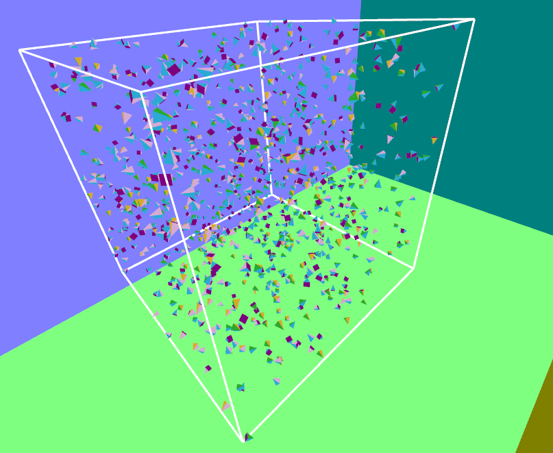

# openGL playground
For playing around with openGL in C++.

The starter code is lifted from https://github.com/bartvbl/TDT4230-Assignment-1
 

## TODO:
- [x] Visualize bounding box as a wireframe
- [x] Visualize particles as tetrahedrons (using instancing)
- [x] Visualize particles as arbitrary meshes
- [ ] Implement boids behaviour in particles
- [ ] Implement naive flocking
- [ ] Come up with a good way to structure the program

### Less important TODOs:
- [ ] Make a better obj loader (that doesn't emit so many warnings)

## Project structure

`main.cpp` initializes the window, `program.cpp` sets up openGL settings and `gameLogic.cpp` handles input initialization and updating. Most of the interesting implementation (bounding box and particles) is in `particles`. I have really only tweaked `gameLogic.cpp` slightly and the `particles` folder, the rest is as it was when I started out.
## Building:
1. `git clone --recursive https://github.com/Embla-Flatlandsmo/openGL-playground.git`
2. `cd openGL-playground`
3. `cmake .`
4. `cmake --build .`
5. The executable should be in `./Debug`

Alternatively using VS Code:
1. `git clone --recursive https://github.com/Embla-Flatlandsmo/openGL-playground.git`
2. `cd openGL-playground`
3. `code .`
4. Using the CMake extension, let cmake do its thing
5. Use `Ctrl+Shift+P` then type `CMake: Build`
The executable should be found in `/build`

Note that because I'm using `file(COPY res DESTINATION ${CMAKE_RUNTIME_OUTPUT_DIRECTORY})` in the root `CMakeLists.txt`, the stuff in the res folder might not update inbetween builds. Haven't found a fix for that yet.