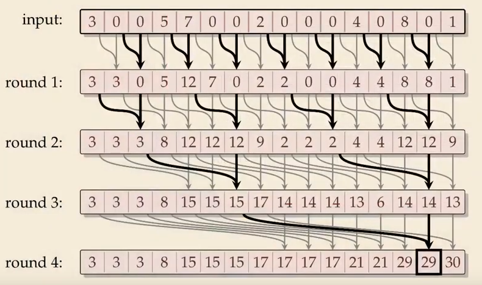

# openGL playground
For playing around with openGL in C++.

The starter code is lifted from https://github.com/bartvbl/TDT4230-Assignment-1
 

## TODO:
### Boids
- [x] Visualize bounding box as a wireframe
- [x] Visualize particles as tetrahedrons (using instancing)
- [x] Visualize particles as arbitrary meshes
- [x] Implement boids behaviour in particles
- [x] Implement naive flocking
- [ ] Clean up ugly compute shader code
- [x] Implement dynamic spatial hashing ala [Wicked Engine Net](https://wickedengine.net/2018/05/21/scalabe-gpu-fluid-simulation/)
- [x] Implement bin sorting with counting sort ala [this Nvidia thing](https://on-demand.gputechconf.com/gtc/2014/presentations/S4117-fast-fixed-radius-nearest-neighbor-gpu.pdf)
- [x] Implement GUI for boid parameters
- [x] Sort boids instead of updating boid indices (reindex rework)
- [x] Improve prefix sum calculation
- [ ] Make number of cells configurable (fixed to 2048 because of prefix sum shader now)
- [ ] Wrap-around distance checking
- [ ] Do the rest of the things necessary to make A MILLION BOIDS!!!!
- [ ] Come up with a good way to structure the program
### Clouds
- [x] Parametric rendering in fragment shader
- [ ] Use CPU camera to do viewing transform in frag shader

### Less important TODOs:
- [ ] Make a better obj loader (that doesn't emit so many warnings)

## Project structure

`main.cpp` initializes the window, `program.cpp` sets up openGL settings and `gameLogic.cpp` handles input initialization and updating. Most of the interesting implementation (bounding box and particles) is in `particles` and `res/shaders`. I have really only tweaked `gameLogic.cpp` slightly, the `particles` folder and the `res/shaders` folder. The rest is as it was when I started out.
## Building:
1. `git clone --recursive https://github.com/Embla-Flatlandsmo/openGL-playground.git`
2. `cd openGL-playground`
3. `cmake .`
4. `cmake --build .`
5. The executable should be in `./Debug`

Alternatively using VS Code:
1. `git clone --recursive https://github.com/Embla-Flatlandsmo/openGL-playground.git`
2. `cd openGL-playground`
3. `code .`
4. Using the CMake extension, let cmake do its thing.
    a. I use GCC as my active kit which I downloaded using chocolatey.
5. Use `Ctrl+Shift+P` then type `CMake: Build`
The executable should be found in `/build`

## An explanation of the different shaders
### gridBuckets
Takes in a particle's position and figures out which cell it belongs to. Then, it increases the count of that cell by 1.
### prefixSum
Prefix sum takes the gridBuckets as input as a readonly. From the input it generates the prefix sum:

To do the prefix sum in parallel I have implemented the algorithm pretty much like this, which comes from [here](https://youtu.be/lavZl_wEbPE?t=701):
 

The shader implements one round of the prefix sum, to get the global sync I dispatch the shader multiple times.

### reindex
To make indexing more convenient, I take in gridBuckets and prefixSum to make a new particle index list. 

For each particle, I find its corresponding cell and look up its value in prefixSum. This value will describe the offset into the particle index buffer. Then, I get the value of gridBuckets and add that to the index. Finally, gridBuckets is decremented. At the end, gridBuckets is all 0.

For example, I have a particle with cell ID = 30. The particle has ID 247, which means that `Positions[247]` will give me the particle's position. Now, to find the new index of the particle I do `newIndex = PrefixSum[30]+gridBuckets[30]`, then decrement gridBuckets atomically. The new particleIndex is then `ParticleIndices[newIndex] = 247`

### computeForce
Checks the particles in the current and neighbouring cells (3x3x3=27 cells in total) and updates boid acceleration based on proximity to neighbours

### update
Classic forward euler. Each particle gets their position and velocity updated by `vel += acc*dt` and `pos += vel*dt`. Also some box boundary collisions happen here.